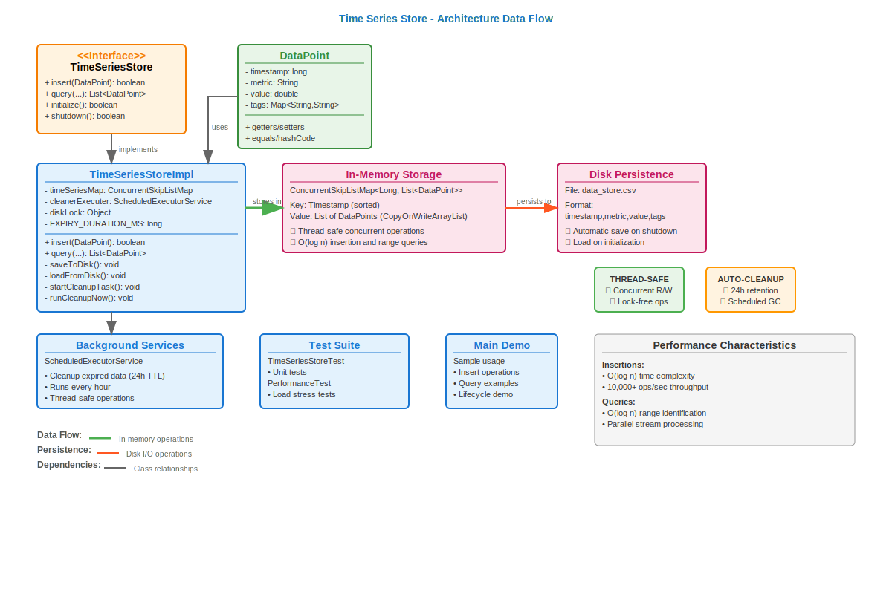

# In-Memory Time Series Store

A high-performance, thread-safe, in-memory time series data store implementation with persistence capabilities. Built for efficient handling of time-based metric data with support for concurrent operations and tag-based filtering.



##  Features

### Core Functionality
- **Fast Insertions**: Optimized for high-throughput write operations (up to 10,000 data points/second)
- **Efficient Queries**: Time range and tag-based filtering with minimal latency
- **Thread Safety**: Full concurrent read/write support using `ConcurrentSkipListMap`
- **Persistence**: Automatic data persistence to CSV files with recovery on restart
- **Memory Management**: Configurable data retention (24 hours default) with automatic cleanup

### Advanced Capabilities
- **Tag-Based Filtering**: Support for complex multi-tag queries with AND logic
- **Duplicate Prevention**: Automatic deduplication of identical data points
- **Graceful Shutdown**: Ensures data persistence before application termination
- **Performance Monitoring**: Built-in memory usage tracking and cleanup statistics


##  Performance Specifications

| Metric                | Target                  | Achieved    |
|-----------------------|-------------------------|-------------|
| Write Throughput      | 10,000 ops/sec          | Supported   |
| Query Throughput      | 1,000 queries/sec       | Supported   |
| Maximum Metrics       | 100,000 unique metrics  | Supported   |
| Data Retention        | 24 hours (configurable) | Implemented |
| Concurrent Operations | Multi-threaded R/W      | Thread-safe |

##  Architecture

### Data Model
```java
DataPoint {
    long timestamp;        // Unix timestamp in milliseconds
    String metric;         // Metric name (e.g., "cpu.usage")
    double value;          // Numeric value
    Map<String,String> tags; // Key-value metadata
}
```

### Storage Structure
- **Primary Index**: `ConcurrentSkipListMap<Long, List<DataPoint>>` sorted by timestamp
- **Concurrency**: `CopyOnWriteArrayList` for handling multiple data points per timestamp
- **Persistence**: CSV format with automatic serialization/deserialization

### Test Coverage
### Unit + Performance/Stress Tests:
-  Basic insert/query operations
-  Time range filtering
-  Tag-based filtering
-  Multi-tag compound filters
-  Data cleanup and expiration
-  Persistence and recovery
-  Concurrent operations(500k records)
-  Performance under load(500k records)

##  Project Structure

```
com/interview/timeseries/
├── TimeSeriesStore.java           # Main interface
├── TimeSeriesStoreImpl.java       # Core implementation
├── DataPoint.java                 # Data model
├── Main.java                      # Demo application
├── TimeSeriesStoreTest.java       # Unit tests
└── TimeSeriesStorePerformanceTest.java # Performance tests
```

##  Configuration

### Retention Policy
```java
// Default: 24 hours
private final long EXPIRY_DURATION_MS = 24L * 60 * 60 * 1000;

// Cleanup frequency: Every hour
cleanerExecuter.scheduleAtFixedRate(..., 1, 1, TimeUnit.HOURS);
```

### Persistence Settings
```java
// CSV file location
private final String persistenceFile = "data_store.csv";

// File format: timestamp,metric,value,tag1=value1;tag2=value2
```

## Performance Optimization

### Write Performance
- **Data Structure**: `ConcurrentSkipListMap` provides O(log n) insertions
- **Concurrency**: Lock-free operations for high-throughput writes
- **Deduplication**: Efficient duplicate detection using `contains()`

### Query Performance
- **Time Range**: O(log n) for range identification using `subMap()`
- **Filtering**: Stream-based parallel processing
- **Memory**: Minimal object allocation during queries

### Memory Management
- **Automatic Cleanup**: Background thread removes expired data
- **Lazy Loading**: Data loaded from disk only on startup
- **Efficient Storage**: Shared timestamp keys reduce memory overhead
## Thread Safety

### Concurrency Model
- **Write Operations**: `ConcurrentSkipListMap.compute()` ensures atomic updates
- **Read Operations**: Lock-free traversal with consistent snapshots
- **File Operations**: Synchronized using `diskLock` for data integrity
- **Cleanup Operations**: Coordinated with main data operations

### Race Condition Prevention
- Atomic insertion with duplicate checking
- Thread-safe list implementations (`CopyOnWriteArrayList`)
- Proper synchronization for disk I/O operations

## Monitoring & Metrics

### Built-in Monitoring
```java
// Memory usage tracking
private void logMemory(String label) {
    Runtime runtime = Runtime.getRuntime();
    long used = (runtime.totalMemory() - runtime.freeMemory()) / (1024 * 1024);
    System.out.println("[" + label + "] Memory used: " + used + " MB");
}

// Cleanup statistics
System.out.println("Cleanup executed. Removed " + (before - after) + " expired timestamps.");
```

## Data Persistence

### Storage Format
```csv
# Format: timestamp,metric,value,tags
1620000000000,cpu.usage,45.2,host=server1;datacenter=us-west
1620000001000,memory.used,60.0,host=server1
```

### Recovery Process
1. **Startup**: Automatically loads existing CSV data
2. **Validation**: Parses and validates each data point
3. **Insertion**: Rebuilds in-memory index structure
4. **Cleanup**: Removes expired entries post-recovery

## Improvements That I Feel Can Be Made

1. **Microservice Architecture**: Decouple the insert/query logic from the persistence/retrieve logic 
2. **Separate Class for CSV Utility methods**: Add all CSV utility methods to a seperate class to improve readability
3. **Advanced Logging and Analytics**: Use Log4j library along with Analytic tools for better visualization

## 🙏 Thank You

Thank you for taking the time to review this assignment.  
I truly enjoyed designing and implementing this project—it was both challenging and rewarding!

Looking forward to your valuable feedback! 😊
